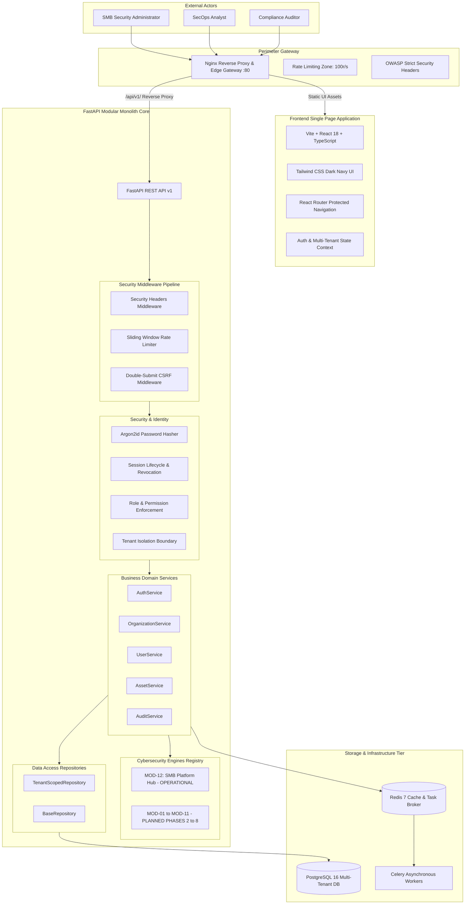

# PREVENT-X High-Level Architecture Diagram

```mermaid
flowchart TB
    subgraph External [External Actors]
        Admin[SMB Security Administrator]
        Analyst[SecOps Analyst]
        Auditor[Compliance Auditor]
    end

    subgraph Edge_Perimeter [Perimeter Gateway]
        Nginx[Nginx Reverse Proxy & Edge Gateway :80]
        Nginx_Rate[Rate Limiting Zone: 100r/s]
        Nginx_Headers[OWASP Strict Security Headers]
    end

    subgraph Frontend_App [Frontend Single Page Application]
        Vite[Vite + React 18 + TypeScript]
        Tailwind[Tailwind CSS Dark Navy UI]
        Router[React Router Protected Navigation]
        Context[Auth & Multi-Tenant State Context]
    end

    subgraph Backend_App [FastAPI Modular Monolith Core]
        API_V1[FastAPI REST API v1]
        
        subgraph Middlewares [Security Middleware Pipeline]
            M_SecHeaders[Security Headers Middleware]
            M_RateLimit[Sliding Window Rate Limiter]
            M_CSRF[Double-Submit CSRF Middleware]
        end
        
        subgraph Security_Domain [Security & Identity]
            Argon2[Argon2id Password Hasher]
            SessionMgr[Session Lifecycle & Revocation]
            RBAC[Role & Permission Enforcement]
            TenantGuard[Tenant Isolation Boundary]
        end

        subgraph Core_Services [Business Domain Services]
            AuthSvc[AuthService]
            OrgSvc[OrganizationService]
            UserSvc[UserService]
            AssetSvc[AssetService]
            AuditSvc[AuditService]
        end

        subgraph Modules_Catalog [Cybersecurity Engines Registry]
            Mod_12[MOD-12: SMB Platform Hub - OPERATIONAL]
            Mod_01_11[MOD-01 to MOD-11 - PLANNED PHASES 2 to 8]
        end

        subgraph Data_Access [Data Access Repositories]
            TenantRepo[TenantScopedRepository]
            BaseRepo[BaseRepository]
        end
    end

    subgraph Storage_Tier [Storage & Infrastructure Tier]
        PostgreSQL[(PostgreSQL 16 Multi-Tenant DB)]
        Redis[(Redis 7 Cache & Task Broker)]
        CeleryWorkers[Celery Asynchronous Workers]
    end

    Admin --> Nginx
    Analyst --> Nginx
    Auditor --> Nginx

    Nginx -->|Static UI Assets| Frontend_App
    Nginx -->|/api/v1/ Reverse Proxy| API_V1

    API_V1 --> Middlewares
    Middlewares --> Security_Domain
    Security_Domain --> Core_Services
    Core_Services --> Modules_Catalog
    Core_Services --> Data_Access
    Data_Access --> PostgreSQL
    Core_Services --> Redis
    Redis --> CeleryWorkers
```
