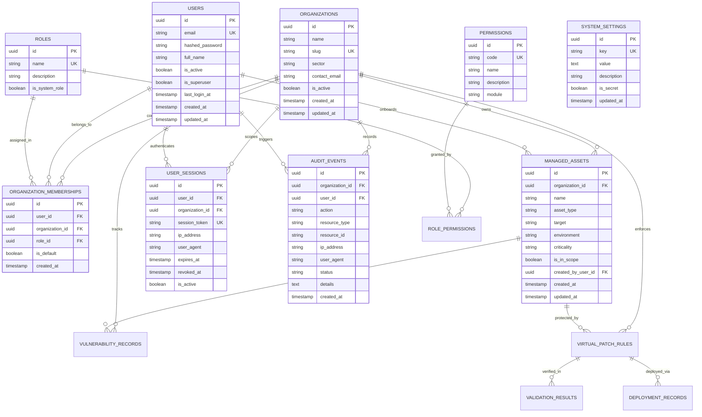

# PREVENT-X Database Entity-Relationship Diagram

```mermaid
erDiagram
    ORGANIZATIONS ||--o{ ORGANIZATION_MEMBERSHIPS : "contains"
    ORGANIZATIONS ||--o{ MANAGED_ASSETS : "owns"
    ORGANIZATIONS ||--o{ USER_SESSIONS : "scopes"
    ORGANIZATIONS ||--o{ AUDIT_EVENTS : "records"
    ORGANIZATIONS ||--o{ VULNERABILITY_RECORDS : "tracks"
    ORGANIZATIONS ||--o{ VIRTUAL_PATCH_RULES : "enforces"

    USERS ||--o{ ORGANIZATION_MEMBERSHIPS : "belongs_to"
    USERS ||--o{ USER_SESSIONS : "authenticates"
    USERS ||--o{ MANAGED_ASSETS : "onboards"
    USERS ||--o{ AUDIT_EVENTS : "triggers"

    ROLES ||--o{ ORGANIZATION_MEMBERSHIPS : "assigned_in"
    ROLES ||--o{ ROLE_PERMISSIONS : "authorizes"
    PERMISSIONS ||--o{ ROLE_PERMISSIONS : "granted_by"

    MANAGED_ASSETS ||--o{ VULNERABILITY_RECORDS : "exposes"
    MANAGED_ASSETS ||--o{ VIRTUAL_PATCH_RULES : "protected_by"

    VIRTUAL_PATCH_RULES ||--o{ VALIDATION_RESULTS : "verified_in"
    VIRTUAL_PATCH_RULES ||--o{ DEPLOYMENT_RECORDS : "deployed_via"

    ORGANIZATIONS {
        uuid id PK
        string name
        string slug UK
        string sector
        string contact_email
        boolean is_active
        timestamp created_at
        timestamp updated_at
    }

    USERS {
        uuid id PK
        string email UK
        string hashed_password
        string full_name
        boolean is_active
        boolean is_superuser
        timestamp last_login_at
        timestamp created_at
        timestamp updated_at
    }

    ROLES {
        uuid id PK
        string name UK
        string description
        boolean is_system_role
    }

    PERMISSIONS {
        uuid id PK
        string code UK
        string name
        string description
        string module
    }

    ORGANIZATION_MEMBERSHIPS {
        uuid id PK
        uuid user_id FK
        uuid organization_id FK
        uuid role_id FK
        boolean is_default
        timestamp created_at
    }

    USER_SESSIONS {
        uuid id PK
        uuid user_id FK
        uuid organization_id FK
        string session_token UK
        string ip_address
        string user_agent
        timestamp expires_at
        timestamp revoked_at
        boolean is_active
    }

    MANAGED_ASSETS {
        uuid id PK
        uuid organization_id FK
        string name
        string asset_type
        string target
        string environment
        string criticality
        boolean is_in_scope
        uuid created_by_user_id FK
        timestamp created_at
        timestamp updated_at
    }

    AUDIT_EVENTS {
        uuid id PK
        uuid organization_id FK
        uuid user_id FK
        string action
        string resource_type
        string resource_id
        string ip_address
        string user_agent
        string status
        text details
        timestamp created_at
    }

    SYSTEM_SETTINGS {
        uuid id PK
        string key UK
        text value
        string description
        boolean is_secret
        timestamp updated_at
    }
```

